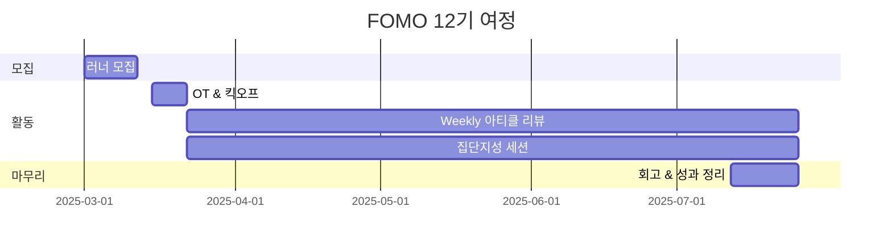

# FOMO — First One Moving Onward

> **고민할 시간에 움직인다.**
> 망설이는 사람들 사이에서 가장 먼저 발을 떼고 전진하는 선구자 크루.


```
F : First   — 가장 먼저
O : One     — 단 한 사람
M : Moving  — 움직이는
O : Onward  — 앞으로
```

## 🌟 프로젝트 목표 (Project Vision)

_"Vibe Coding 시대, Agent Harness를 현업에서 실전 적용하는 선구자 집단"_

- **Agent Harness 아티클 리뷰** — 매주 최신 Vibe Coding & Agent 관련 아티클을 리뷰하고 토론
- **집단지성 문제 해결** — 본인의 Harness 및 프로젝트 고민을 함께 풀어가는 세션
- **현업 얼라인먼트** — 일과 연결하여 현업에서의 실질적 고민을 함께 해결
- **행동 우선 마인드셋** — 불안해하며 지켜만 보는 대신, 먼저 치고 나가는 실행력

## 🧑 역동적인 팀 소개 (Dynamic Team)

| 역할 | 이름 | 소속 / 직무 | 주요 관심 분야 |
| :---: | :---: | :---: | :---: |
| **빌더** | [김재현](https://www.linkedin.com/in/kjh941213/) | KT DS / 소프트웨어 엔지니어 | Vibe Coding / Agent Harness |
| **러너** | 김철완 | SK On / 데이터 분석가 | AI Agent, 업무 자동화, 데이터 분석 |
| **러너** | 고남길 | 라미솔루션 / COO | 에이전트 메모리 시스템, 웹 프레임워크 개발 |
| **러너** | 유상현 | WIZnet / 디지털 마케팅 매니저 | AI 콘텐츠 자동화, 수익 구조 설계 |
| **러너** | 안승원 | - | - |
| **러너** | 이규민 | KT / 리서치 엔지니어 | AI Agent, 강화학습, 문제 정의 |
| **러너** | 이지훈 | 큐리어슬리 / 모바일 엔지니어 | AI Agent 오케스트레이션, AX 설계 |
| **러너** | 강동규 | 경희대학교 / 컴퓨터공학과 | Agent Harness 설계, PKM, 오픈소스 |
| **러너** | 유종선 | SK On / 공정기술 엔지니어 | 제조 AI, 공정 데이터 분석 플랫폼 |
| **러너** | 이상윤 | 한글과컴퓨터 / 기술 리서처 | 바이브코딩, 에이전트 하네스 설계 |
| **러너** | [백승진](https://www.linkedin.com/in/baekseungjin) | 제이엘케이 / 백엔드 엔지니어 | Agent 아키텍처, LLMOps, Observability |
| **러너** | 김승혁 | 나무기술 / AI 엔지니어 | AI Agent 설계, 시멘틱 네트워크, 바이브코딩 |
| **러너** | 전민정 | AICESS / TTS 엔지니어 | 다국어 TTS, 하네스 기반 바이브 개발 |
| **러너** | 김정수 | 루나크 / 테크니컬 디렉터 | 게임 AX, AI 캐릭터/에이전트 시스템 |
| **러너** | 김은지 | CJ대한통운 / 데이터 분석가 | MCP 기반 Agent, HCI, GNN |

## 🚀 프로젝트 로드맵 (Project Roadmap)



## 🛠️ 우리의 개발 문화 (Our Development Culture)

```python
class FOMO:
    def __init__(self):
        self.motto = "고민할 시간에 움직인다"
        self.tools = {
            'communication': 'Discord',
            'version_control': 'GitHub',
            'docs': 'GitHub Wiki'
        }

    def weekly_cycle(self):
        return """
        📖 아티클 리뷰 — Agent Harness / Vibe Coding 최신 아티클 발표 & 토론
        🔧 프로젝트 세션 — 본인 Harness & 프로젝트 고민 공유, 집단지성으로 해결
        💼 현업 얼라인 — 실무에서 겪는 문제를 스터디와 연결하여 풀어가기
        """
```

## 📅 활동 내역 (Activity Log)

| 날짜 | 내용 | 비고 |
| :---: | :---: | :---: |
| 2025/03/15 | OT & 킥오프 | 온라인 |
| 2025/03/22 | Week 1 — 아티클 리뷰 & 프로젝트 세션 | 온라인 |
| ... | ... | ... |

## 🌱 참여 안내 (How to Engage)

### 스터디 러너 모집

📢 **모집 기간**: 2025/03/01 ~ 2025/03/12
👥 **모집 인원**: 15명
🚀 **활동 시작**: 2025/03/15부터 18주간

### 참여 방법

1. **러너로 참여** — 아티클 리뷰, 프로젝트 고민 공유 등 적극적 참여
2. **청강 참여** — 공개 세션 참여 가능

❗ 참여 링크: [가짜연구소 디스코드](https://discord.gg/pseudolab)
❗ 커뮤니케이션 채널: 디스코드 #Room-?

> 누구나 청강을 통해 모임을 참여하실 수 있습니다.
> 1. 특별한 신청 없이 정기 모임 시간에 맞추어 디스코드 채널로 입장
> 2. Magical Week 중 행사에 참가
> 3. Pseudo Lab 행사에서 만나기

## Contributors 😃


## Acknowledgement 🙏

이 프로젝트는 가짜연구소 Open Academy로 진행됩니다.
여러분의 참여와 기여가 '우연한 혁명(Serendipity Revolution)'을 가능하게 합니다. 모두에게 깊은 감사를 전합니다.

FOMO is developed as part of Pseudo-Lab's Open Research Initiative.
Special thanks to our contributors and the open source community for their valuable insights and contributions.

## About Pseudo Lab 👋🏼

Pseudo-Lab is a non-profit organization focused on advancing machine learning and AI technologies.
Our core values of **Sharing, Motivation, and Collaborative Joy** drive us to create impactful open-source projects.
With over 5k+ researchers, we are committed to advancing machine learning and AI technologies.
